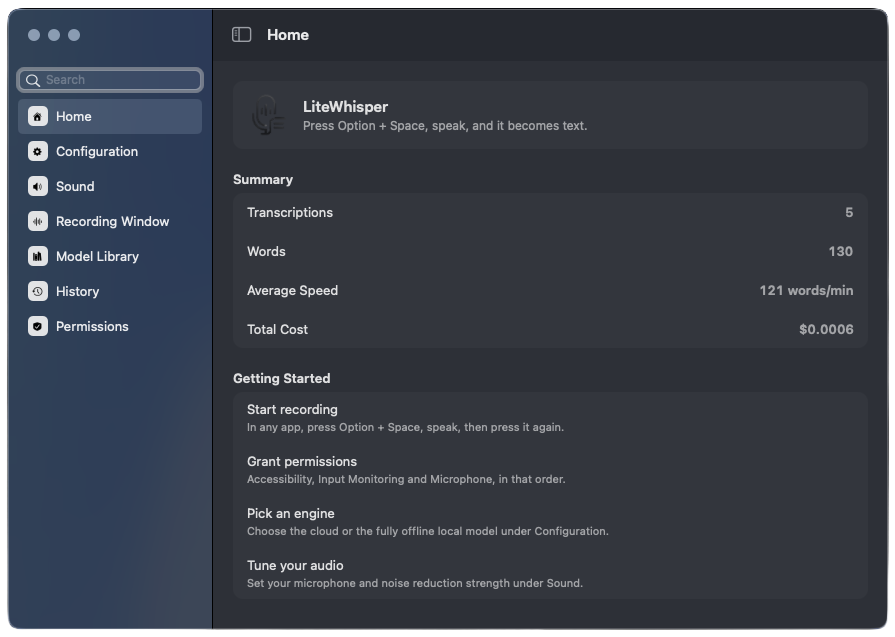
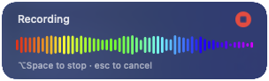
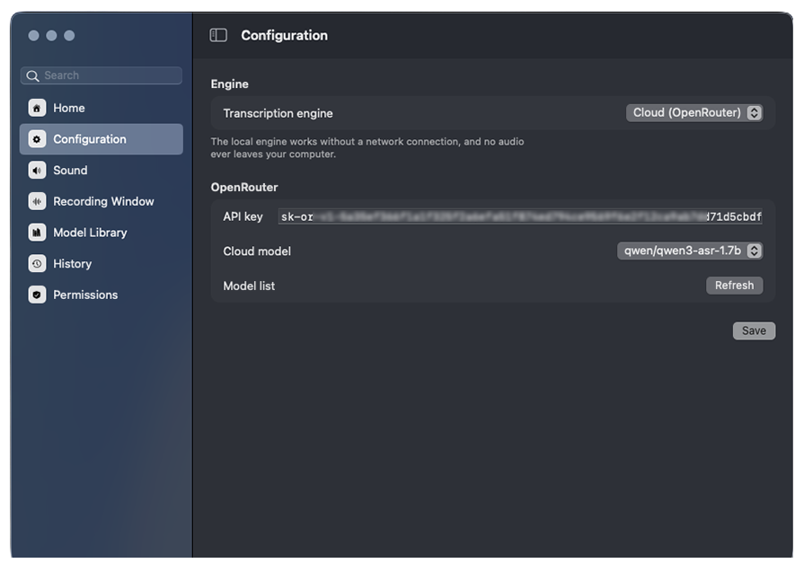
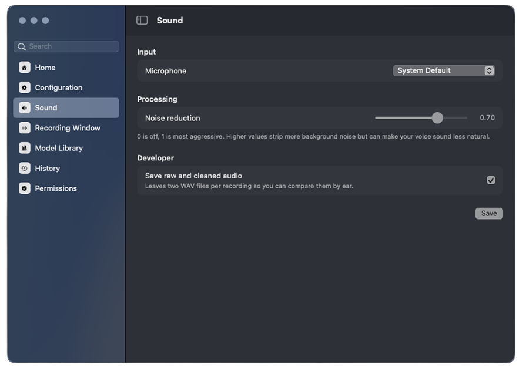
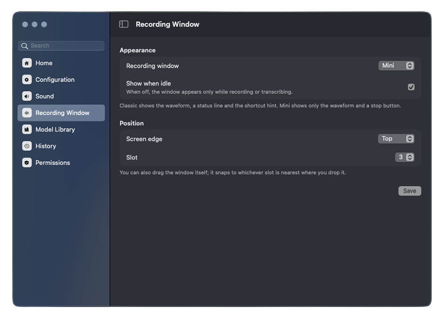
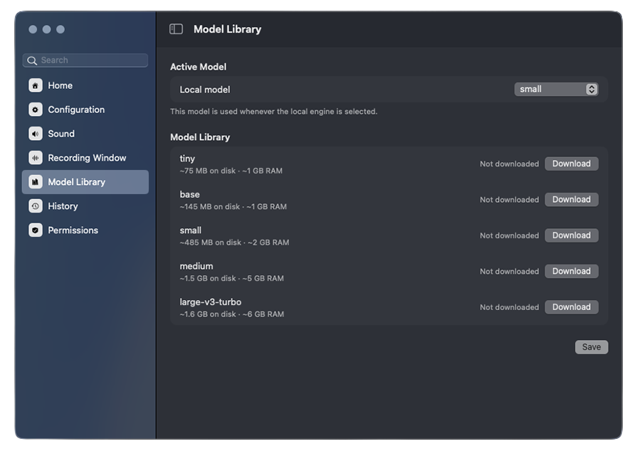
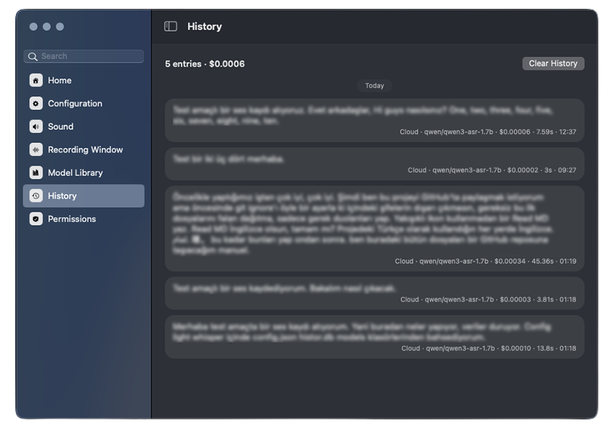
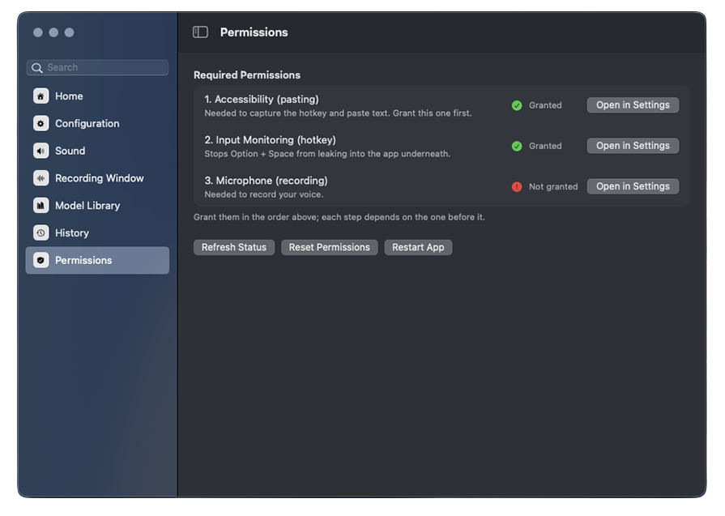

# LiteWhisper

A speech-to-text app that lives in the macOS menu bar. Press **Option + Space**
to start recording, press it again to stop; the text is copied to the clipboard
and pasted straight into whatever app has focus. **Esc** cancels a recording in
progress.

Transcription runs through one of two engines:

- **Cloud** — OpenRouter, using your own API key. Cost and duration are recorded
  per transcription.
- **Local** — faster-whisper, fully offline. No audio leaves the machine.

Built with PyObjC against AppKit, following Apple's macOS 26 design guidance: a
real `NSSplitViewController` sidebar with Liquid Glass material, source-list
navigation, and grouped settings rows.



## The recording overlay

While you speak, a floating panel shows a live waveform driven by the
microphone level. It never takes focus, so it cannot interrupt whatever you are
typing into, and it floats above full-screen apps.

**Classic** — waveform, status line, and the shortcut hint:



**Mini** — just the waveform and a stop button:


Once you stop, the bars give way to a travelling swell while the transcription
is in flight, so the wait reads as work in progress rather than a freeze. A
third style, hidden, turns the overlay off entirely.

The panel can be dragged anywhere and snaps to the nearest of twenty dock
positions — five along each edge of the screen.

## Status

This is an early release. Dictation works end to end and is what the app is
built around today, but it is the foundation rather than the finished product.

The plan is to grow LiteWhisper from a dictation tool into a combined
**dictation and AI chat** application: speaking would not only produce text but
also let you talk to a model, ask follow-up questions about what you just
dictated, and have the result rewritten, summarised or translated in place.
Expect the interface and the stored data format to change as that takes shape.

## Features

- Global hotkey captured at the event-tap level, so the keystroke never leaks
  into the focused app
- Floating recording overlay with a live rainbow waveform, three display styles
  and twenty dock positions
- Audio cleanup before every transcription: high-pass filter, spectral noise
  reduction with an adjustable strength, silence trimming and normalisation
- Searchable settings window modelled on System Settings
- History stored in SQLite, shown as chat bubbles grouped by day, with per-entry
  cost and a copy button
- Automatic language detection

## Screenshots

Pick an engine and a cloud model; the model list is fetched live from
OpenRouter:



Choose an input device and set how hard the noise reduction works:



Style and position for the recording overlay:



Download and remove local Whisper models, with disk and memory requirements
shown per size:



Every transcription, grouped by day, with the model and cost that produced it:



Live status for the three permissions macOS requires, in the order they have to
be granted:



## Requirements

- macOS 26 (Tahoe) or later — the UI uses `NSGlassEffectView` and the macOS 26
  sidebar APIs
- Apple silicon
- Python 3.12+ to build from source

## Install

Open `LiteWhisper-<version>.dmg` and drag **LiteWhisper** onto **Applications**.

The app is ad-hoc signed, so on a machine other than the one that built it
Gatekeeper will block the first launch. Right-click the app and choose **Open**,
or clear the quarantine attribute:

```bash
xattr -dr com.apple.quarantine /Applications/LiteWhisper.app
```

Removing that step entirely requires signing and notarising with an Apple
Developer account.

## Permissions

macOS requires three permissions, and they must be granted **in this order** —
each one depends on the previous:

1. **Accessibility** — to capture the hotkey and paste text
2. **Input Monitoring** — to stop Option + Space leaking into the app underneath
3. **Microphone** — to record audio

The app's Permissions page shows live status for all three, links straight to
the relevant System Settings pane, and can reset the permissions and relaunch.

## Configuration

Create an API key at [openrouter.ai](https://openrouter.ai), enter it on the
Configuration page and save. The model list is fetched live from OpenRouter
using that key.

The local engine needs no key. Download a Whisper model from the Model Library
page, which shows disk and memory requirements for each size and lets you remove
models you no longer want.

## Build from source

```bash
python3 -m venv venv
source venv/bin/activate
pip install -r requirements.txt
python main.py
```

Running from source is fine for development, but macOS ties privacy permissions
to a signed application bundle, so the permission prompts do not appear
reliably. Package the app for any real testing.

## Packaging

```bash
./package.sh
```

Produces `dist/LiteWhisper-<version>.dmg`. The version is read from
`CFBundleShortVersionString` in `setup.py`; bump it there before a release.

## Where data lives

| Path | Contents |
| --- | --- |
| `~/.config/lite-whisper/config.json` | Settings, including the API key |
| `~/.config/lite-whisper/history.db` | Transcription history (SQLite) |
| `~/.config/lite-whisper/models/` | Downloaded local Whisper models |

Nothing is written inside the repository. The API key is stored in plain text in
the config file.

## Project layout

| File | Role |
| --- | --- |
| `main.py` | Menu bar app, recording lifecycle, transcription thread |
| `hotkey.py` | Global event tap for Option + Space and Esc |
| `audio_recorder.py` | Microphone capture and level metering |
| `audio_cleanup.py` | Filtering, noise reduction, trimming, normalisation |
| `transcriber/` | Cloud and local transcription backends |
| `main_window.py` | Split-view window shell and sidebar |
| `nsui.py` | Auto Layout building blocks shared by every page |
| `recording_window.py` | Floating overlay, waveform rendering, docking |
| `history.py` | SQLite storage and statistics |
| `permissions.py` | TCC status checks and System Settings links |

## Roadmap

Planned, roughly in order:

- **Post-processing** — automatic punctuation and cleanup of the raw
  transcription, plus a custom vocabulary for names and jargon the model keeps
  getting wrong
- **Tone and style rewriting** — turn a rambling dictation into an email, a
  commit message or a summary, using presets
- **Chat** — a conversation view where dictated text becomes a message, so you
  can speak to a model rather than only transcribe
- **Context from history** — ask questions about things you dictated earlier
- **Signed and notarised builds** so installation does not require working
  around Gatekeeper

## Licence

MIT
